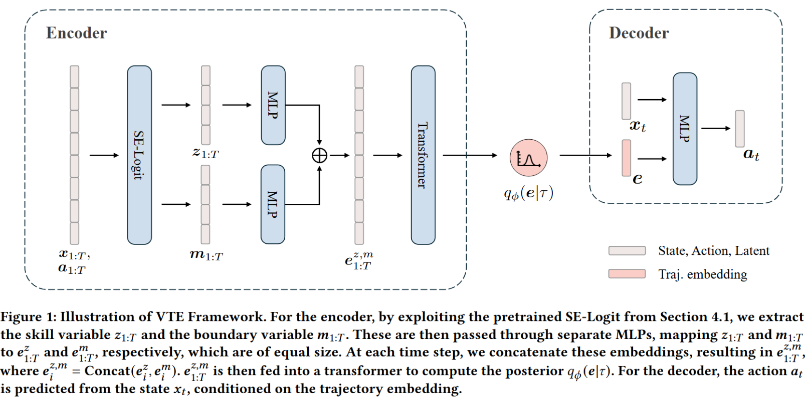

# On Learning Informative Trajectory Embeddings for Imitation, Classification and Regression
[](https://arxiv.org/abs/2501.09327)
[](https://github.com/Erasmo1015/vte/blob/main/LICENSE)

This repository contains the implementation of the paper On Learning Informative Trajectory Embeddings for Imitation, Classification and Regression, published in the proceeding of the 24th International Conference on Autonomous Agents and Multi-Agent Systems (AAMAS 2025). We introduce an unsupervised approach called Variational Trajectory Encoding (VTE) for encoding state-action trajectories into informative embeddings without the need for external reward or goal labels.
</img>

## Setup
### Install dependencies
Please install dependencies using the following command: 
```bash
git clone https://github.com/Erasmo1015/vte.git
conda create -n vte python=3.7.12
conda activate vte
cd vte/main

pip install -r requirements.txt
pip install -e .
```

Please download the dataset from this link:
[Dropbox Link](https://www.dropbox.com/scl/fo/4pn7str4yl8bwzolmq8ii/AMei8NZzlLh_ysmTGThM9BQ?rlkey=97lfiyykuyab7cxwk7wnduq0n&st=klhzccha&dl=0)
Move the folder inside vte/main/ (e.g. vte/main/experts)

### Training script
We provide sample training scripts for Hopper and Half-Cheetah environment:

- Hopper
```bash
cd pipeline/
bash pipeline.sh --SHORT_NAME hopper --ENV_NAME Hopper-v2 --LEVEL 3 --KLD_ALPHA 1 --AGENT_ACTOR_LR 3e-05 --AGENT_CRITIC_LR 3e-05 --AGENT_INIT_TEMP 1e-12 --ENV_LEARN_STEPS 1e5 --METHOD_LOSS v0 --SAVE_LAST True
```

- Half-Cheetah
```bash
cd pipeline/
bash pipeline.sh --SHORT_NAME cheetah --ENV_NAME HalfCheetah-v2 --LEVEL 3 --KLD_ALPHA 10 --AGENT_ACTOR_LR 5e-05 --AGENT_CRITIC_LR 1e-04 --AGENT_INIT_TEMP 1e-12 --ENV_LEARN_STEPS 2e6 --METHOD_LOSS value --SAVE_LAST True
```

### Imitation learning task
The imitation learning task is completed in the last stage of the pipeline script (e.g. stage 3).

We also provide sample python commands for the imitation learning task in main/scripts/sample_script.sh. After stage 2 is completed in the pipeline, these commands can be called directly outside the pipeline for tuning the hyperparameters easily.


### Embedding the trajectories
Once the training is finished (after stage 2), the encoder model can be used to embed 900 trajectories prepared for classification and regression learning task. 
Example script:
```bash
python embed_hil.py Hopper_900 ../experts/hopper/Hopper-v2_300_409r.pkl,../experts/hopper/Hopper-v2_300_879r.pkl,../experts/hopper/Hopper-v2_300_3205r.pkl -b env=\"hopper\" -b checkpoint=\"experiments/$encoder_ckpt_path\" --embed_mode=mean --cond_dim=10 --exp_id=no_id
cp ../cond/hopper/no_id/Hopper_900.pkl data/ours/
```

Modify the paths in encoder/mlp.py to your dataset path of 900 trajectories, for example: 
```python
def return_dataset(args):
    ...
    elif "hopper" in args.exp_name.lower():
        dataset_paths = ['$full_path_to_Hopper-v2_300_409r.pkl',
                        '$full_path_to_Hopper-v2_300_879r.pkl',
                        '$full_path_to_Hopper-v2_300_3205r.pkl']
```

### Classification
```bash
cd encoder
python mlp.py Hopper_900 --emb_size=10 --label=level --epoch=80 --datadir=ours
```

### Regression
``` bash
cd encoder
python mlp.py Hopper_900 --emb_size=10 --label=return --epoch=80 --datadir=ours
```

## Benchmark Comparison
We provide the benchmark implementations with rewards (GCPC).
### Install dependencies for benchmark
Please install dependencies using the following command: 
```bash
conda create -n gcpc python=3.7.12
codna activate gcpc
cd vte/GCPC

pip install -r requirements.txt
pip install -e .
```

### Training scripts for benchmark
We provide sample training scripts for Hopper and Half-Cheetah environment:

- Hopper
```bash
python -m gcpc.train env_name=hopper-random-v1 model=trajnet exp=gym_trl model.model_config.mask_type=mae_rc custom=True
python -m gcpc.train env_name=hopper-random-v1 model=policynet exp=gym_pl model.model_config.tjn_ckpt_path=$tjn_ckpt_path custom=True
```

- Half-Cheetah
```bash
python -m gcpc.train env_name=halfcheetah-medium-v1 model=trajnet exp=gym_trl model.model_config.mask_type=mae_rc custom=True
python -m gcpc.train env_name=halfcheetah-medium-v1 model=policynet exp=gym_pl model.model_config.tjn_ckpt_path=$tjn_ckpt_path custom=True
```
## Acknowledgement
The imitation learning algorithm is built on [IQ-learn](https://github.com/Div99/IQ-Learn).

## Citation
Please consider citing our paper if you find the repo helpful in your work:

```bibtex
@article{ge2025learning,
  title={On Learning Informative Trajectory Embeddings for Imitation, Classification and Regression},
  author={Ge, Zichang and Chen, Changyu and Sinha, Arunesh and Varakantham, Pradeep},
  journal={arXiv preprint arXiv:2501.09327},
  year={2025}
}
```
